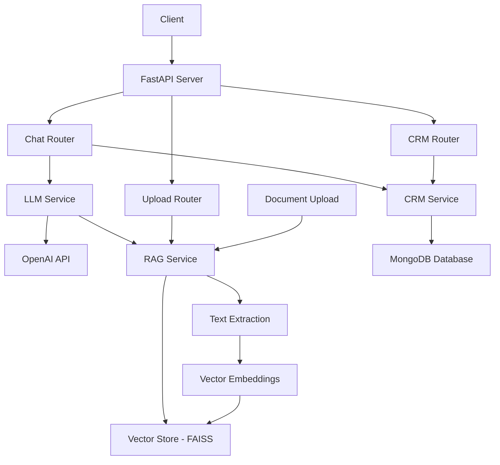

# Multi-Agentic Conversational AI System

A comprehensive Python-based RESTful API application that enables natural language conversation with Large Language Models (LLM), integrated with Retrieval Augmented Generation (RAG) and a custom-built CRM system.

## 🚀 Features

- **Conversational Chatbot with RAG**: Dynamic document retrieval and context-aware responses
- **CRM Integration**: User data capture, conversation history, and session management
- **Document Processing**: Support for PDF, TXT, CSV, and JSON files
- **Session Management**: Persistent conversation sessions with categorization
- **User Context Awareness**: Personalized responses based on user information
- **RESTful API**: Clean, well-documented API endpoints

## 🏗️ Architecture



## 📋 Requirements

- Python 3.8+
- OpenAI API Key
- SQLite (included with Python)

## 🛠️ Installation

1. **Clone the repository**
   ```bash
   git clone <repository-url>
   cd Hackathon
   ```

2. **Create virtual environment**
   ```bash
   python -m venv .venv
   source .venv/bin/activate  # On Windows: .venv\Scripts\activate
   ```

3. **Install dependencies**
   ```bash
   pip install -r requirements.txt
   ```

4. **Set up environment variables**
   ```bash
   cp .env.example .env
   # Edit .env and add your OpenAI API key
   ```

5. **Run the application**
   ```bash
   python run.py
   ```

The API will be available at `http://localhost:8000`

## 📚 API Documentation

### Base URL
```
http://localhost:8000/api/v1
```

### Core Endpoints

#### 1. Chat Endpoints

**POST** `/chat`
- **Description**: Send a message and get AI response with RAG and CRM context
- **Request Body**:
  ```json
  {
    "user_id": "string",
    "message": "string",
    "session_id": "string (optional)",
    "use_rag": true,
    "rag_context": "string (optional)"
  }
  ```
- **Response**:
  ```json
  {
    "response": "AI response text",
    "model_used": "gpt-3.5-turbo",
    "processing_time": 1.23,
    "rag_used": true,
    "user_context_used": true,
    "conversation_history_used": true,
    "tokens_used": 150,
    "session_id": "uuid",
    "error": false
  }
  ```

**POST** `/session`
- **Description**: Create a new conversation session
- **Request Body**:
  ```json
  {
    "user_id": "string",
    "category": "general"
  }
  ```

**POST** `/reset`
- **Description**: Reset conversation memory
- **Request Body**:
  ```json
  {
    "user_id": "string",
    "session_id": "string (optional)"
  }
  ```

#### 2. Document Upload

**POST** `/upload_docs`
- **Description**: Upload documents for RAG knowledge base
- **Form Data**:
  - `file`: Document file (PDF, TXT, CSV, JSON)
  - `file_type`: Type of file

#### 3. CRM Endpoints

**POST** `/crm/create_user`
- **Description**: Create a new user profile
- **Request Body**:
  ```json
  {
    "name": "John Doe",
    "email": "john@example.com",
    "company": "Tech Corp",
    "phone": "+1234567890",
    "preferences": {}
  }
  ```

**PUT** `/crm/update_user/{user_id}`
- **Description**: Update user information

**GET** `/crm/user/{user_id}`
- **Description**: Get user information

**GET** `/crm/conversations/{user_id}`
- **Description**: Get conversation history for a user

**GET** `/crm/conversation/{session_id}/messages`
- **Description**: Get all messages for a specific session

**PUT** `/crm/conversation/{session_id}/category`
- **Description**: Update conversation category

## 🔧 Configuration

### Environment Variables

Create a `.env` file in the root directory:

```env
OPENAI_API_KEY=your_openai_api_key_here
```

### Database

The system uses SQLite for the CRM database. The database file (`crm.db`) will be created automatically when the application starts.

## 📖 Usage Examples

### 1. Basic Chat Interaction

```python
import requests

# Send a message
response = requests.post("http://localhost:8000/api/v1/chat", json={
    "user_id": "user123",
    "message": "Hello, my name is John and I work at Tech Corp"
})

print(response.json())
```

### 2. Create User and Start Session

```python
# Create user
user_response = requests.post("http://localhost:8000/api/v1/crm/create_user", json={
    "name": "John Doe",
    "email": "john@example.com",
    "company": "Tech Corp"
})

user_id = user_response.json()["user_id"]

# Create session
session_response = requests.post("http://localhost:8000/api/v1/session", json={
    "user_id": user_id,
    "category": "support"
})

session_id = session_response.json()["session_id"]

# Chat with session
chat_response = requests.post("http://localhost:8000/api/v1/chat", json={
    "user_id": user_id,
    "session_id": session_id,
    "message": "I need help with my account"
})
```

### 3. Upload Documents for RAG

```python
# Upload a PDF document
with open("document.pdf", "rb") as f:
    files = {"file": f}
    data = {"file_type": "pdf"}
    response = requests.post("http://localhost:8000/api/v1/upload_docs", files=files, data=data)
```

## 🗂️ Project Structure

```
Hackathon/
├── app/
│   ├── __init__.py
│   ├── main.py              # FastAPI application
│   ├── config.py            # Configuration settings
│   ├── models/              # Pydantic models
│   │   ├── chat.py
│   │   ├── upload.py
│   │   └── crm.py
│   ├── routers/             # API routes
│   │   ├── chat.py
│   │   ├── upload.py
│   │   └── crm.py
│   ├── services/            # Business logic
│   │   ├── llm_service.py
│   │   ├── rag_service.py
│   │   └── crm_service.py
│   └── vector_store/        # FAISS vector store
├── run.py                   # Application entry point
├── requirements.txt         # Python dependencies
├── README.md               # This file
└── .env                    # Environment variables
```

## 🔍 API Testing

### Using Swagger UI

1. Start the application
2. Visit `http://localhost:8000/docs`
3. Test endpoints directly from the browser

### Using curl

```bash
# Health check
curl http://localhost:8000/health

# Chat
curl -X POST http://localhost:8000/api/v1/chat \
  -H "Content-Type: application/json" \
  -d '{"user_id": "test123", "message": "Hello"}'
```

## 🚀 Deployment

### Local Development
```bash
python run.py
```

### Production
```bash
uvicorn app.main:app --host 0.0.0.0 --port 8000
```

## 📊 Monitoring

The API provides metadata in responses including:
- Processing time
- Tokens used
- RAG usage status
- User context usage
- Conversation history usage

## 🔒 Security Considerations

- Configure CORS properly for production
- Use environment variables for sensitive data
- Implement proper authentication/authorization
- Validate all input data
- Rate limiting for API endpoints

## 🤝 Contributing

1. Fork the repository
2. Create a feature branch
3. Make your changes
4. Add tests
5. Submit a pull request

## 📄 License

This project is licensed under the MIT License.
